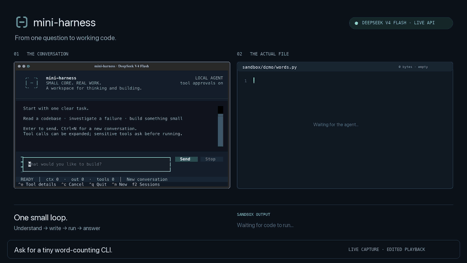
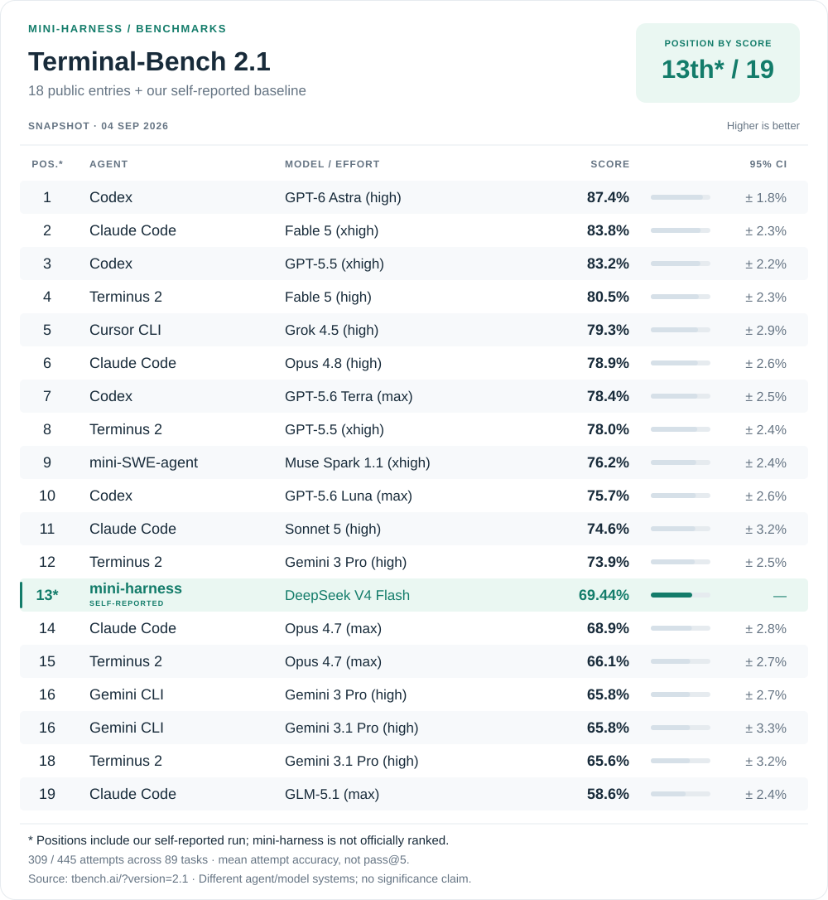

<div align="center">
  <picture>
    <source media="(prefers-color-scheme: dark)" srcset="assets/logo-dark.svg">
    <source media="(prefers-color-scheme: light)" srcset="assets/logo-light.svg">
    
  </picture>
</div>

<p align="center">
  
  <br>
  <sub>Offline TUI demo · scripted responses · no API calls</sub>
</p>

## Why mini-harness?

- **Small, but complete.** About 1,600 lines of Python: eight tools, context
  compaction, request retries, streaming responses, and session memory.
- **A practical baseline.** Evaluated on SWE-bench Verified and Terminal-Bench
  2.1 with DeepSeek V4 Flash. See the results below.
- **Built for learning.** Follow the [agent loop](src/mini_harness/agent.py),
  [tools](src/mini_harness/tool/box.py), [compaction](src/mini_harness/compact.py),
  and [retry policy](src/mini_harness/retry_request.py) in ordinary Python.
  The optional [TUI](tui.py) is a single file you can read and modify.

## Benchmarks

Historical, self-reported results with **DeepSeek V4 Flash**.

| Benchmark | Solved / attempts | Score |
| --- | ---: | ---: |
| SWE-bench Verified | 401 / 500 | **80.2%** |
| Terminal-Bench 2.1 | 309 / 445 | **69.44%** |

<p align="center">
  <picture>
    <source media="(prefers-color-scheme: dark)" srcset="assets/terminal-bench-ranking-dark.svg">
    <source media="(prefers-color-scheme: light)" srcset="assets/terminal-bench-ranking-light.svg">
    
  </picture>
</p>

The figure inserts our score into the [public Terminal-Bench 2.1 leaderboard](https://www.tbench.ai/?version=2.1)
as of **September 4, 2026**; **13th of 19 is an illustrative position, not an official
rank**. The Terminal-Bench result averages five attempts on each of 89 tasks,
not pass@5. See [evaluation details, recorded failures, and reproduction limits](BENCHMARKS.md).

## Get started

### 1. Download and install

Install [uv](https://docs.astral.sh/uv/getting-started/installation/) if you do not
have it, then clone the repository. Python 3.12+ is required; uv can install it.

```sh
# macOS / Linux — install uv once, then restart your terminal
curl -LsSf https://astral.sh/uv/install.sh | sh
```

```sh
git clone https://github.com/mini-harness/mini-harness.git
cd mini-harness
uv python install 3.12
uv sync --locked
```

### 2. Try it without an API key

```sh
uv run tui.py --demo
```

### 3. Connect the agent

Set your [DeepSeek API key](https://platform.deepseek.com/api_keys) in the shell,
then launch the TUI. No `.env` file is needed.

```sh
export DEEPSEEK_API_KEY="your-api-key"
uv run tui.py
```

`Enter` sends a message · `Ctrl+N` starts a session · `F2` opens sessions ·
`Ctrl+E` expands tools · `Ctrl+C` cancels · `Ctrl+Q` quits.

The agent reads the project workspace; local file tools write to `sandbox/`.
The TUI asks before shell or subagent calls. Sessions stay in `.local/` and are
ignored by Git. Cancelling a task keeps file edits already completed.

For the plain terminal interface:

```sh
uv run --locked mini-harness
```
